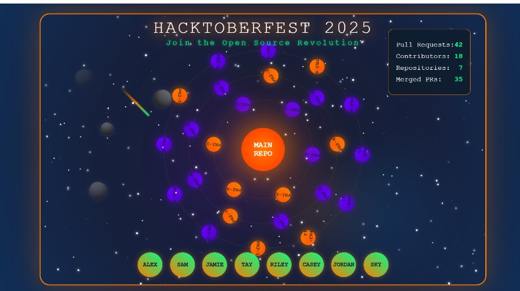

# 🌌 Hacktoberfest Code Galaxy


**Hacktoberfest Code Galaxy** is a CSS and JavaScript art project inspired by the creativity of open-source.  
It visualizes a glowing galaxy of animated orbs, celebrating the spirit of collaboration and code during Hacktoberfest 🌠.

---

## 🚀 Live Demo
[GitHub Pages Link][(https://couragecodejourney.github.io/hacktoberfest-code-galaxy)](https://couragecodejourney.github.io/hacktoberfest-code-galaxy/)

---

## 🧩 Features
- Pure **HTML**, **CSS**, and a touch of **JavaScript**
- Smooth galaxy-inspired animations
- Lightweight and fully responsive design
- Hacktoberfest-themed color palette and energy ✨

---

## 🛠️ Tech Stack
- **HTML5** for structure  
- **CSS3** for styling, gradients, and animations  
- **JavaScript** for dynamic interactivity  

---

## 🖥️ Running Locally

To run this project locally on your computer:

```bash
# Clone this repository
git clone https://github.com/CourageCodeJourney/hacktoberfest-code-galaxy.git

# Navigate to the project directory
cd hacktoberfest-code-galaxy

# Open index.html in your browser
````

No dependencies or installations required — it’s pure frontend code 💻

---

## 🎯 Contributing

Contributions are welcome — this project is open for **Hacktoberfest**!
You can contribute by:

* 🌈 Adding new color themes
* ✨ Improving animations
* 🪐 Adding stars, constellations, or visual effects
* 🧠 Refactoring or cleaning CSS
* 🧩 Adding interactivity (e.g., mouse hover galaxy trails)

### How to Contribute

1. **Fork** this repository
2. **Create a new branch**

   ```bash
   git checkout -b feature-name
   ```
3. **Make your changes and commit**

   ```bash
   git commit -m "Add new galaxy animation"
   ```
4. **Push to your fork**

   ```bash
   git push origin feature-name
   ```
5. **Submit a Pull Request**

All valid pull requests during October count toward your Hacktoberfest goals ✅

---

## 🪩 Hacktoberfest

This project proudly participates in [Hacktoberfest 2025](https://hacktoberfest.com/) —
an annual celebration of open-source software hosted by **DigitalOcean**, **Appwrite**, and **GitHub**.

Make your contribution between **October 1–31** and join thousands of developers in building the open web 🌍

---

## 📸 Preview (Coming Soon)




---

## 📄 License

This project is licensed under the [MIT License](LICENSE).
You’re free to use, remix, and improve — just give credit where it’s due 🌟

---

## 💫 Author

Built with passion by **[Courage Paul (CourageCodeJourney)](https://github.com/CourageCodeJourney)**

> “Creativity begins when you turn logic into art.” 🌌


